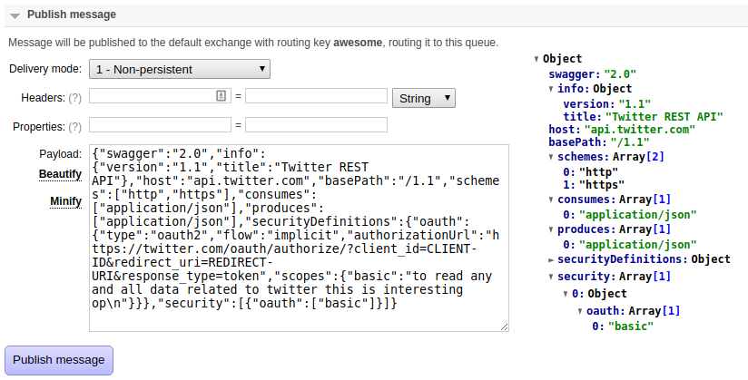

# Google chrome extension that improves RabbitMQ web console UI

[Web Store link](https://chrome.google.com/webstore/detail/rabbitmq-ui/aojjjccnchdgfojkplokcaikfoighecb)

### Features
* Saves last message for each queue and restores it when you open queue page
* JSON parsing for messages in queue payload
* Buttons to beautify and minify JSON in payload

### Requirements

* Tested on RabbitMQ 3.6.10
* Currently requires url to match expression http://*:15672/*

## Screenshots

JSON Formatter by [mohsen1/json-formatter-js](https://github.com/mohsen1/json-formatter-js)